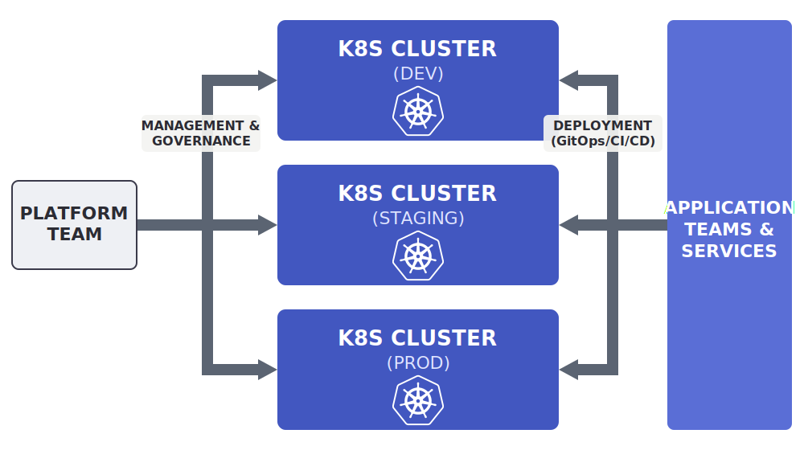
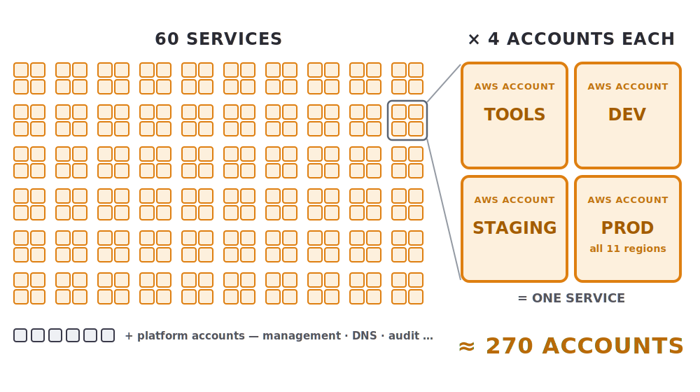
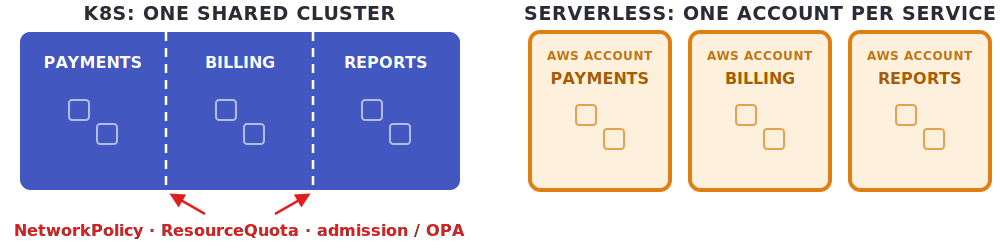
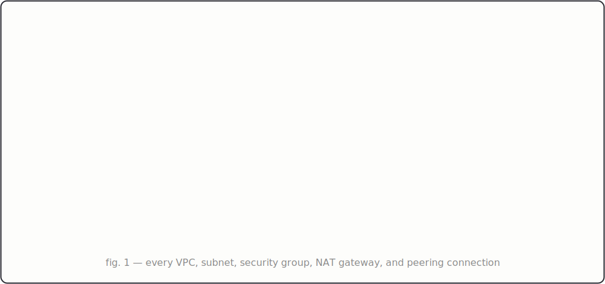
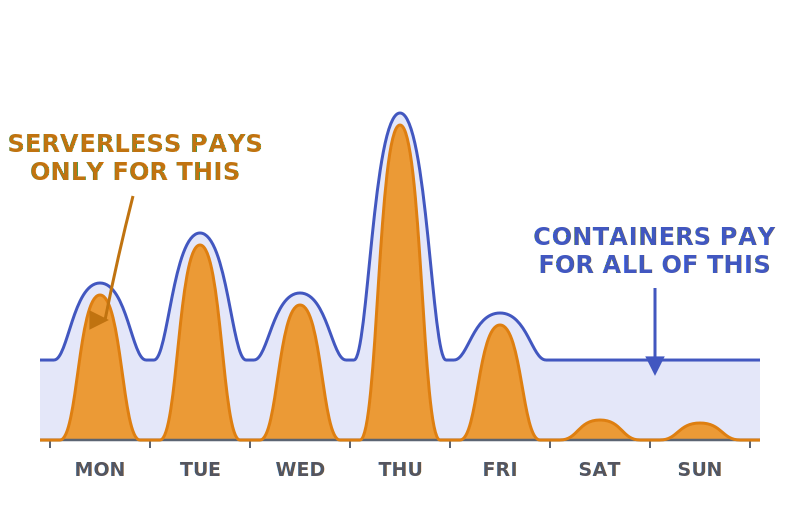

<!-- _class: lead dark -->

<p class="eyebrow">AWS · Serverless · Team autonomy</p>

# Architecture for Autonomy

## How true serverless gives every team freedom to ship

**Danil Agafonov**
<span class="role">Senior Staff Software Engineer · Diligent Corporation</span>

<!--
Title slide. The posture of the whole talk is set in the first 30
seconds: this is an INVITATION to see how another team builds, not a
fight. Don't promise controversy, don't tease a takedown. One good
opener: "I want to show you a different corner of AWS — the way some
teams build that most of you have never tried. Not to sell it. Just so
you've seen it work."

FAKE-ARTIFACT EDITION: same talk, five deadpan humor beats placed at
the attention troughs — a tier list, an alignment chart, a Slack
thread, an empty network diagram, and two phone lock screens. No image
macros: every joke wears the costume of a tool the room uses daily,
and every joke IS a slide of the argument restated. Deliver everything
else identically. Rule for all five: never explain the joke, give the
room the seconds it needs to read, take the laugh, move on. Total cost
~90s over slides.md.
-->

---

<!-- _class: glow-b split -->

# How most of us build today

- **Compute** — capacity you provision
- **Isolation** — namespaces, quotas, policy
- **The cloud** — you never touch it directly
- **Multi-region** — a quarter-long project
- **Platform team** — builds your platform



<!--
Spoken frame: open with "It's a good model — mature, powerful, an
ecosystem with an answer for everything," walk the five assumptions,
and close with "None of this is wrong — it's just how this model
works." The slide is only the five anchor words; you carry the rest.

The right-hand diagram is the turn: you've walked five abstract
"assumptions," and the picture names them — centralized K8s clusters a
platform team governs, that app teams deploy into. Deliver the
"…centralized, under the platform team's control, doesn't it?" beat
verbally; it's the pivot straight into the invitation.

The respect on this slide is load-bearing. If the audience feels
defended-against here, the whole reframe fails — they must feel SEEN.
Each law should get nods of recognition; read them slowly and let each
one land as "yes, that's my life, and it's fine."

The "wiki page" line is an affectionate laugh, not a mock — deliver it
as someone who has personally maintained that wiki page.

These five laws are the setup for the entire deck: each one gets
inverted by a later slide (compute → the "what counts" slide, isolation
→ the isolation slide, no-direct-cloud-access → the accounts + ownership
slides, multi-region → the deploys slide, platform team → the
platform-team slide). The cloud bullet is the setup for the whole
"ownership is mostly just IaC" run: today the platform team's
abstraction sits between you and the cloud; serverless-per-account hands
you the raw primitives to build on directly. Do NOT
foreshadow that explicitly — the inversions should surprise.

Do not say "Kubernetes is great BUT". There is no "but" on this slide.
-->

---

<!-- _class: dark moves glow-c -->

# The invitation

Let me show you a different (less centralized) way to build — two moves:

**One cloud account per service**, and the team builds on it **directly** —
*that's where the autonomy comes from.*

**True serverless** inside each account —
*that's what makes the model affordable and operable.*

<!--
The invitation and the thesis at once — and the thesis is honestly TWO
theses, stated as two:

1. Account-per-service + the team building on it directly, in code →
   the autonomy: never blocked, physical isolation, scoped on-call, a
   platform team that owns guardrails instead of a platform.
2. True serverless → what makes hundreds of accounts viable: idle ≈ $0,
   no network layer, no capacity ops. Without it the model still WORKS
   — the economics slide prices it on Fargate at ~20x — it's just hard
   to justify.

Say the causal structure out loud: the accounts give you the autonomy;
serverless is what makes account-per-service affordable and operable.
Stating the separation yourself is what defuses the smart skeptic who
would otherwise "catch" you conflating them — the separation IS the
argument, and the economics slide cashes it in with numbers.

Deliver it warmly — "let me show you" — inviting, not a hard sell. The
non-pushy posture carries through to the closer ("you don't have to
move anything today"); here you're opening the door and telling them
what's on the other side.

Keep it short — 30 seconds. It's a lead slide: say it, let it land,
move to the example. -->

---

<!-- _class: meme glow-e disclaim -->

![w:860 A 3-by-3 alignment chart of tenancy models with GOOD–EVIL and LAWFUL–CHAOTIC axes. Lawful good: namespace per service, OPA, quotas, NetworkPolicy, a cluster per environment. Neutral good: a cluster per team. Chaotic good, tagged "this talk": an AWS account per service + serverless. Lawful neutral: every DNS record needs a meeting. True neutral: whatever the last consultant left behind. Chaotic neutral: ClickOps, documented in screenshots. Lawful evil: ResourceQuotas set by finance. Neutral evil: everything in namespace default. Chaotic evil: the admin kubeconfig is pinned in #general](meme-alignment-chart.svg)

<!--
ARTIFACT BEAT (~20s), and now the "YOU ARE HERE" map: you just named the
two moves on the invitation slide, and the chaotic-good cell IS those two
moves ("an account per service + serverless — this talk"). Show the room
where the thesis lands on the landscape of tenancy philosophies. Every
alignment chart is a mirror — the laugh is finding yourself. The room is
LAWFUL GOOD; tell them so with respect ("namespace-per-service with OPA is
the correct way to run clusters — that's most of you"), then point one
rung over to chaotic good. Deliver it as a fast TEASER, not a summary —
"we're the orange corner; here's why" — then move on; the reasons are the
next several slides, don't spoil them here. The evil row is pure
recognition comedy; let it land on its own, and if anyone laughs too hard
at chaotic evil, "no judgment, we've all been in that org" keeps it warm.
Lawful neutral (every DNS record needs a meeting) is a quiet plant — the
Slack thread and the "no ticket" DNS slide pay it off later. Straight into
the setup.
-->

---

<!-- _class: glow-d -->

# The setup

One example — a SaaS company:

- **20 teams** — shipping independently
- **~60 services** — ~3 per team
- **Event-driven** — EventBridge · SQS
- **Multiple products** — each team owns a slice
- **11 isolated prod regions** — data sovereignty

<!--
30-second slide. Sets the scene so every later number (60 services,
270 accounts) lands without re-establishing context.

This isn't any specific company, it's a shape that maps onto many real
SaaS orgs. The audience should think: "that's basically us."

EDA mention is doing real work: it's the architectural pattern that
makes true serverless natural (Lambda + EventBridge + SQS = the EDA
stack). A request-response monolith would push you toward different
choices.

If asked "what about smaller orgs?" — same shape applies down to ~5
teams; the breakeven where account-per-service starts to pay off is
roughly 5+ teams with multi-region requirements.
-->

---

<!-- _class: glow-e cards -->

# What we're looking for: autonomy

- **Never blocked** — nothing in your way to ship
- **Never broken** — no neighbor in your blast radius
- **Genuinely yours** — your on-call, your bill

> *Team Topologies*: a **stream-aligned team**.

<!--
Define ownership concretely so it's not a buzzword. The slide's spine is
the TWO-WAY BOUNDARY — these are the three tests we'll use to read
serverless; every later slide answers to one of these three beats.

Three beats:
1. Never blocked (you -> others): you ship by touching only what you
   own. No external dependency on the critical path to ship.
2. Never broken (others -> you): nobody else's change lands in your
   blast radius. You debug your stack, not a foreign one.
3. Genuinely yours: on-call and bill, scoped to exactly your service.
   The visceral pair — every engineer has been woken for someone
   else's problem, and most have never seen the bill for what they ship.

Note what changed from the old deck: this is a WISH LIST, not a set of
promises to defend in a fight. We state what a team wants before we look
at serverless — then the following slides show how it happens to
deliver each one as a side effect of how it works.

Verbal flourish if you want it: "I've seen teams in this model ship 20+
times a day. Not because they're heroic — because nothing is in their
way." Keep the number off the slide; it invites "prove it."

Team Topologies (Skelton & Pais) citation is one line, then move on —
"stream-aligned team" comes back on the platform-team slide.
-->

---

<!-- _class: glow-f figtop disclaim -->

# What counts as serverless


<!--
INTERACTIVE OPENER (~30-45s incl. audience). Show the tier list with NO
properties yet — this is a puzzle, not an answer. Ask the room: "can
anyone guess why I sorted them this way? What's the line between the top
and the bottom?" Take 2-3 guesses out loud — you'll hear "managed?",
"scales to zero?", "cheap?", "no servers?" — all partially right, none
complete. Sit in it; the guessing IS the attention hook on the driest
topic of the talk. Then advance: the NEXT slide is the answer key (the
five properties). Hints if the room is quiet: the F row ("the quotes are
load-bearing") says it's about the PROPERTY, not the marketing name; the
empty B row says there's no "pretty good" — a service either has the
property or it doesn't. Tiles uniform on purpose; only the ROW ranks.
Don't reveal the rule here — the two-slide split only works if you hold
it. Disclaimer stays: it's an opinionated ranking. App Runner in C if
someone pushes: scale-to-zero bolted on, but still bills provisioned
memory while paused. -->

---

<!-- _class: glow-c -->

# What counts as serverless

- **No lifecycle to own**
- **No capacity to size**
- **Billed per request, not per hour**
- **Scales to zero, on its own**
- **Identity, not network**

<!--
THE ANSWER KEY to the previous slide's puzzle. After the room has
guessed, reveal the sorting rule: these five properties. This is the
definitional heart of the talk; everything downstream references it.
Keep the SLIDE tight (root + what it forces); the depth here is for
delivery and Q&A.

The framework is four core properties + one consequence, and the whole
point is that they are NOT independent — the lifecycle property is
foundational and everything else follows from it:
1. NO LIFECYCLE TO OWN. No long-lived thing to operate: no SIGTERM,
   connection draining, health checks, rolling deploys, warm state to
   keep warm, OS or base image to patch. You hand over a unit of work
   (a handler, an object, a message); the platform decides when,
   whether, and how often anything runs. This is the one the rest
   fall out of.
2. NO CAPACITY SIZING — no instance tier, no min/max range, no ACU
   floor, no vCPU/memory pick, and (the second-order tell that catches
   Fargate) no autoscaling POLICY. A target-tracking metric is capacity
   planning with extra steps.
3. BILLING UNIT = WORK UNIT, not capacity x time — per invocation /
   request / message / GB stored, never allocated-capacity x wall-clock.
   Diagnostic: do nothing for an hour, do you pay for the hour?
4. SCALE TO ZERO intrinsically and automatically — idle ~free, and it
   goes to zero on its own and returns per-request with no machinery you
   assemble. (Fargate can be forced to zero manually — that's why it's
   the boundary case; the automatic round-trip is what counts.)
5. (CONSEQUENCE, not axiom) instant, fine-grained, request-driven
   ELASTICITY — falls out of 1-4. Granularity/latency tell: Lambda bills
   per-ms and wakes per-request; Fargate's minute-minimum billing and
   tens-of-seconds cold start are the model confessing it scales a
   coarse, slow, persistent unit.

Why they cluster: if there's no lifecycle to own, there's nothing to
size (2), nothing accrues idle so billing collapses to work (3), zero is
the resting state (4), and materialization is per-request (5). The two
failure modes factor cleanly: AURORA fails at the lifecycle property by
PHYSICS — a warm relational buffer pool + connections + planner caches +
transactions force a resident lifecycle, so it violates everything
downstream (DSQL is AWS rebuilding the architecture to escape this).
FARGATE fails by DESIGN
CHOICE — stateless-capable, so it COULD be non-resident, but AWS drew the
boundary at the persistent container, not the request, so it opts into
residency and inherits the same violations. Same failed test; one by
physics, one by design.

"Identity, not network" is ORTHOGONAL to the compute cascade: access is
by IAM identity (who you are), not network location (where you sit) — no
VPC, subnets, security groups, or placement. The later "there is no
network" slide cashes it in.

Honest caveats if pushed: it's a SPECTRUM, not a binary — the interesting
cases live in the middle. App Runner bolts scale-to-zero + request-driven
autoscaling onto Fargate (gains 2 and 4) but still bruises 3 (bills
provisioned memory when paused) — which is why it FEELS more serverless
without being clean. DynamoDB on-demand satisfies all five; provisioned
DynamoDB almost none — same service, different mode — so these are
properties of a CONFIGURATION, not a product. And the whole frame is
OPERATOR-FACING, not physics: there are servers underneath; "serverless"
is about what's hidden from YOU, i.e. where the abstraction boundary sits.

Gray-zone caption "a lifecycle you own and size": Fargate/ECS/Aurora keep
a long-lived thing you operate AND make you size it — the lifecycle and
sizing properties, both failed.
The quote marks on Aurora / OpenSearch "Serverless" get a knowing
chuckle. "More on that later" -> the economics slide, where that
resident capacity gets a price tag.

Callback to the puzzle: each property here is the ANSWER to a tile on
the previous slide — Aurora/OpenSearch sit in F because they fail #1
(lifecycle); ECS/Fargate in C because they fail #1 and #2; the S row
passes all five. If someone guessed "scales to zero," tell them they
got #4 — and that the other four are why that alone isn't the whole
story. RDS wasn't on the board; it's gray-zone like Aurora if it comes
up. This slide carries no tier-list disclaimer — it's the real
definition; the "* exaggeration" footnote lives on the puzzle slide. -->


---

<!-- _class: glow-b split-para -->

# Accounts are cattle, not pets

**K8s:** the cloud is precious — developers never touch it directly.

**Serverless:** one isolated account per service. Vended in minutes. Idle ≈ $0.

**4 per service** — tools · dev · staging · prod

60 services → **~270 accounts**



<!--
The first inversion, and the one that makes K8s-native audiences
blink: 270 accounts is a NORMAL number here. Let the number hang for a
second — with clusters it sounds insane, and that reaction is the point.
"That sounds crazy" is the old model's assumptions talking.

The K8s / serverless pair is the template every later slide follows.
State both as fact. No scoring.

Note: prod is one account per service, not one per region. AWS regional
isolation (data physically resides in the region you write to) handles
the data residency requirement. Cross-region access from a single IAM
principal is controlled via SCPs scoping `aws:RequestedRegion`.

Account-per-region for prod is also defensible (tighter IAM blast
radius), but adds 10x prod accounts per service. The talk shows the
simpler topology: one prod account per service, AWS regional
architecture handles the rest.

If you have a real org tree diagram, this is THE slide for it. One
picture beats 5 minutes of explanation.

"Idle cost ≈ $0" gets its receipts on the economics slide — if someone
mentally objects "accounts aren't free," that's handled there (the
security baseline is $2-10/mo and it's the ONLY idle).
-->

---

<!-- _class: glow-c duo -->

# Isolation isn't maintained — it just *is*

**Logical** isolation — you maintain it.

**Physical** isolation — nothing to maintain.



> Logical isolation needs constant maintenance. Physical isolation just **is**.

<!--
The talk's best line, delivered as wonder instead of indictment. The
old deck used this to prosecute shared clusters; here it's someone
marveling at the difference: "nobody maintains the boundary — it's
geography."

One breath of cluster-side context is enough. Do NOT relitigate shared
clusters, do NOT tell a 3am war story pointing at a platform team. If
you want a personal beat, make it symmetric lived experience: "I've
been on both ends of that 3am call" — then move to the wonder.

The structural fact carrying the slide: namespace-per-service is the
CORRECT tenancy pattern with clusters, and it still requires admission
controllers, NetworkPolicy, quotas — controls someone owns and
maintains, that hold as long as everything holds (a CVE, an OPA
misconfig, an etcd hiccup can break them). Here the equivalent boundary
is the account: it isn't a policy that holds, it's a fact of the
substrate. That's not a criticism of clusters — it's a difference in
what the two approaches ask you to maintain.

The blockquote is the one-liner that should stick. Read it slowly,
then let the room sit a beat. -->

---

<!-- _class: glow-d -->

# Ownership, illustrated through IaC

The **team that ships** defines it all, in their code —
not the platform team, no tickets.

AWS CDK · Pulumi · Terraform???

<!--
Section opener for the ownership vignettes. The LOAD-BEARING point is
control: the team that SHIPS defines and changes all of its own infra,
in code — the platform team is not in the path, no tickets, no hand-offs.
That's the autonomy claim made concrete, and every following slide is the
same move (the shipping team defines a thing in code), just a different
thing.

The deflationary point is worth saying out loud even though it's off the
slide: "owning your whole infrastructure" sounds grand, but mechanically
it's mostly just IaC — which makes adopting it feel ACHIEVABLE, not
heroic.

"Terraform???" — the three question marks are deliberate, and they'll get
a knowing laugh. The deck (and the speaker) favor CDK: a real programming
language with composable, typed constructs; HCL doesn't compose into
reusable typed APIs. Pulumi is the honest middle ground (real languages),
so it gets no question mark. Don't litigate it on stage — if pushed,
"that's a whole other talk" (it literally is — the AWS-as-framework talk).

"Mostly" is doing honest work: on-call (the on-call slide) isn't code —
it's the consequence of the boundary. Don't over-claim everything is IaC.
-->

---

<!-- _class: meme glow-d disclaim -->


<!--
ARTIFACT BEAT (~25s). The ownership slide as a screenshot. Say nothing
while they read — the thread has its own comic timing (9:03 → 9:41 is
the joke: the ticket aged 38 minutes before it died). The last line is
the thesis of the whole talk in four words: "it's our account." If you
say anything after the laugh, say exactly that line, then advance.
The channel topic ("SLA: 5 business days") is the quiet setup most
people catch on the second look — leave it for them to find. The PR in
the unfurl is literally the next two slides: the Stage code and the
DNS delegation code are what got merged. TONE: the platform team in
this sketch is not villainous — the bot is polite, the queue is real
life. The joke is the QUEUE not existing anymore, not the people.
-->

---

<!-- _class: glow-e -->

# The shape of a service

```typescript
export class MyApplication extends Stage {
  constructor(scope: Construct, id: string, props?: StageProps) {
    super(scope, id, props);

    const dns = new Route53Stack(this, 'Route53');
    const data = new PersistenceStack(this, 'Persistence');
    const web = new WebStack(this, 'Web', { zone: dns.zone });
    new FeatureAStack(this, 'FeatureA', { apiGateway: web.apiGateway, table: data.table });
    new FeatureBStack(this, 'FeatureB', { apiGateway: web.apiGateway, table: data.table });
  }
}
```

One `Stage` = the team's entire service. Deploy it per account, per region.

<!--
The concrete shape of a team's repo: the whole application is ONE
cdk.Stage composed of focused, single-responsibility stacks the team owns
— persistence, web, per-feature stacks, DNS. They COMPOSE: WebStack
creates the API Gateway and hands it down (web.apiGateway), PersistenceStack
hands down the table, Route53Stack the hosted zone — all as typed props.
Feature stacks attach their own routes to the shared gateway. This is the
"AWS is the framework" thesis in miniature — composition with a real
language, not copy-pasted YAML.

If asked: yes, adding methods to a RestApi across stack boundaries makes
cross-stack references (CloudFormation Exports) — fine here because it's
all one team, one Stage, deployed together. Don't go deep on stage.

A Stage is the deployable unit: instantiate MyApplication with
{ env: { account, region } } and you get the entire service in that
account/region. That's the hook for the multi-region slide — the
for-loop is just this Stage, once per region.

FeatureA/FeatureB make a point worth saying out loud: a feature is just
another stack. The team adds capability by adding a stack in its own repo
— no coordination, no shared-platform change.

Keep the stack internals abstract; the point is the COMPOSITION, not any
one stack.
-->

---

<!-- _class: meme glow-b disclaim-lit -->

# Our network architecture <span class="caveat">(to scale)</span>



<!--
ARTIFACT BEAT (~15s). Deadpan is the entire technique: present it as a
completely normal architecture slide. "Before I show you the code, the
network architecture, to scale." Pause. Let the emptiness do the work.
If it needs a nudge: "this is not a rendering error." Do not smile
before they do. The next slide's title is the explanation — advance
into it while the laugh is still going. (For anyone who reads the
caption: yes, that IS the complete inventory.)

The fine print on this slide is INVERTED on purpose — "* not an
exaggeration, take it literally" — because unlike the other artifact
slides, this one is the literal truth. Sharp readers who've noticed
the recurring disclaimer will catch the flip; it's a second, quieter
joke for them.
-->

---

<!-- _class: glow-f dns-note -->

# There is no network

```typescript
// company.com is platform-owned; everything below lives in the team's own CDK app:
const zone = new PublicHostedZone(this, 'Zone', { zoneName: 'payments.company.com' });
// Team writes its own NS records into company.com via the granted role:
new CrossAccountZoneDelegationRecord(this, 'Delegation', {
  delegatedZone: zone,
  parentHostedZoneName: 'company.com',
  delegationRole: Role.fromRoleArn(this, 'Role', 'arn:aws:iam::<dns-account>:role/SubdomainDelegation'),
});
const cert = new Certificate(this, 'Cert', {
  domainName: 'payments.company.com',
  validation: CertificateValidation.fromDns(zone),
});
const api = new RestApi(this, 'Api', {
  domainName: { domainName: 'payments.company.com', certificate: cert },
});
new ARecord(this, 'Alias', { zone, target: RecordTarget.fromAlias(new ApiGateway(api)) });
```

No ticket. No platform involvement. No network engineers.

<!--
This is the "click" slide, and the title is now literal:
with clusters, "networking" is a layer you manage and a team you file tickets
to; here there is no VPC, no subnets, no security groups — true
serverless removed all of it. What's left is DNS + a TLS cert + a custom
domain, and that's a CDK construct the team owns.

The team creates its OWN hosted zone for the subdomain in its OWN
account, then writes the NS records into company.com itself via
CrossAccountZoneDelegationRecord — no manual hand-off, no ticket.

The one-time platform setup (NOT on this slide): in the DNS account,
`parentZone.grantDelegation(role)` on a role assumable by the team's
account (an AccountPrincipal, or an OrganizationPrincipal to cover every
team at once). This is the chicken-and-egg solver: the construct assumes
that role at deploy time and creates the NS records pointing at the
freshly-created zone's name servers — so zone creation and delegation
happen in one `cdk deploy`, in the team's pipeline.

Everything else on the slide is the team's, in their account: zone,
delegation, cert (DNS-validated against their zone), and the alias.

Possible to run this live as a demo if you have time and trust your
wifi. Otherwise, the snippet alone should communicate it.

If a pedant notes "that's not networking," agree cheerfully — that's
the slide title's point: "exactly, there's nothing left to network." -->

---

# Multi-region is a for-loop

```typescript
const PROD_REGIONS = [
  'us-east-1', 'us-west-2', 'ca-central-1', 'eu-west-1', 'eu-central-1',
  'eu-west-2', 'ap-southeast-1', 'ap-southeast-2', 'ap-northeast-1', 'sa-east-1', /* 'me-central-1' :( iykyk */
];

const app = new cdk.App();

class MyPipelineStack extends cdk.Stack {
  constructor(scope: Construct, id: string, props?: cdk.StackProps) {
    super(scope, id, props);
    const pipeline = new CodePipeline(this, 'Pipeline', {
      synth: new ShellStep('Synth', {
        input: CodePipelineSource.gitHub('company/payments', 'main'),
        installCommands: ['n --no-preserve auto', 'corepack enable', 'pnpm install'],
        commands: ['pnpm test', 'pnpm cdk synth'],
      }),
    });
    pipeline.addStage(new MyApplication(this, 'Dev', { env: { account: PAYMENTS_DEV_ACCOUNT, region: 'ca-central-1' } }));
    pipeline.addStage(new MyApplication(this, 'Staging', { env: { account: PAYMENTS_STAGING_ACCOUNT, region: 'ca-central-1' } }));
    for (const region of PROD_REGIONS) {
      pipeline.addStage(new MyApplication(this, `Prod-${region}`, { env: { account: PAYMENTS_PROD_ACCOUNT, region } }));
    }
  }
}

new MyPipelineStack(app, 'Pipeline', { env: { account: TOOLS_ACCOUNT } });
```

<!--
Resist the temptation to go deep here. You have 45 minutes of pipeline/IAM
material ready for Q&A — but on stage, this is one slide.

Say the contrast out loud, with affection rather than
smugness: "With clusters, going multi-region is a quarter-long platform
project. Here it's this for-loop and a PR." It's an observation about
how it works, not a gotcha.

The code is CDK Pipelines (aws-cdk-lib/pipelines). Read it top to bottom:
- The App is the team's whole CDK program.
- MyPipelineStack holds the CodePipeline; synth (ShellStep) pulls from
  the team's GitHub and runs their tests — push to main IS the trigger,
  and the pipeline self-mutates (its own definition is code too).
- addStage takes a Stage — the SAME MyApplication from the
  shape-of-a-service slide, added once per environment: dev, then
  staging, then prod fanned across all 11 regions. That's the promotion
  path, and it's the "4 accounts per service" made concrete — each
  addStage targets a different account via env. One push → dev →
  staging → whole service in every prod region.
- The cross-account story is VISIBLE: the pipeline STACK is deployed
  to the tools account (env: TOOLS_ACCOUNT), while its STAGES target the
  prod account (env: PAYMENTS_PROD_ACCOUNT). That split is the point —
  point at the two `env`s. It works via CDK bootstrap trust: prod is
  bootstrapped to trust tools, so the pipeline assumes a deploy role
  there. No human IAM user has prod write — that's why "ship through code
  review, not tickets" is literally true.

PROD_REGIONS is the 11-region list (defined elsewhere in the app; off
this slide to save room).

No manual gate here on purpose: this team chose continuous deployment,
gated by the test suite in synth. A team that wants eyes-on-diff can add
`stage.addPre(new ManualApprovalStep('Approve'))` — it's the TEAM's
policy, not a mandate (the autonomy point). With clusters, the prod gate is
usually a shared change-management policy the team doesn't own. Mention
this verbally; it's off the slide to keep it clean.

One prod account hosts all 11 region deployments — AWS regional
isolation gives physical data residency (a table in eu-central-1 cannot
end up in us-east-1), and SCPs scoping `aws:RequestedRegion` control
which principals may call which regional endpoints. If asked "couldn't
one IAM role call any region?" — yes, that's exactly what those SCPs
are for.

If someone asks about OIDC, CodePipeline vs Actions, SCPs, change-set
approvals: "Great question, let's chat after — I have a whole talk on
this." Move on.

me-central-1 is COMMENTED OUT of PROD_REGIONS — "/* 'me-central-1' :(
iykyk */" — referencing the March 2026 drone strikes that destroyed
two of the region's three AZs and took the region down for the month
(109 services; AWS waived AND erased March billing from Cost
Explorer). The commented-out array element IS the joke: the code
says, deadpan, "we can't deploy there right now." DELIVERY: don't
explain it and don't do a geopolitics bit — the room that knows,
knows. If a pedant counts 10 active regions against the deck's "11":
correct, that's the point. If it fits the economics thread later, the
one safe verbal aside is "AWS deleted an entire month from Cost
Explorer" — an outage so bad the bill ceased to exist. Keep it about
the infrastructure, never the conflict.
-->

---

<!-- _class: glow-e -->

# On-call only for what you own

The **AWS Shared Responsibility Model**, serverless edition:

| | On-call |
|---|---|
| Hardware · OS · runtime · scaling · patching | **AWS** |
| Concurrency limits · throttling | You |
| Config · bugs · business logic | You |

You carry on-call for **your side of the line — nothing more.**
And the account boundary keeps it to **your service, no one else's.**

<!--
Two ideas. FIRST, the AWS Shared Responsibility Model: AWS is responsible
for security/operation OF the cloud, you for what you put IN it. Serverless
pushes that line WAY up — AWS absorbs the hardware, OS, runtime, scaling,
and patching, so your side shrinks to config, limits, and business logic.
You only carry on-call for YOUR side of the line, and that side is now
small.

SECOND, the account boundary scopes it: the blast radius is one service,
one team — you're never on the hook for another team's incident, or for a
whole region. In K8s, on-call bleeds across the shared cluster (a runaway
workload or a bad upgrade wakes the platform team for everyone in that
region); here there's no shared substrate to answer for. Structure, not
virtue.

For anyone who's done platform on-call this lands hard — they've been
woken at 3am for someone else's problem. Let them have the moment without
rubbing it in. Callback to the autonomy slide ("genuinely yours — your
on-call") and the isolation slide (the boundary is physical).

The lock screens on the next slide are this point's punchline — land
the shared-responsibility line first, then advance into it.
-->

---

<!-- _class: meme glow-c disclaim -->


<!--
ARTIFACT BEAT (~20s). Same 3:12 AM, two worlds. The devastating detail
is the first notification's parenthetical — "(none of them yours)" —
give the room time to reach it. TONE GUARDRAIL: you have been the
left-phone person; say so ("that left phone was mine for years") so
this reads as shared experience, not a dunk on platform on-call. The
right phone isn't "no incidents ever" — it's "your pager only knows
your name now." If pushed later: yes, YOUR bugs still page you — the
on-call slide's table said exactly whose side of the line that is.
-->

---

<!-- _class: glow-b -->

# The platform team owns the guardrails, not the platform

**Guardrails:** Control Tower · Organizations · SCPs · account vending · Identity Center

**Shared constructs:** versioned packages teams *choose* to use

**K8s:** you build the platform.
**Serverless:** AWS is the platform — you just configure and use it.

*collaboration → X-as-a-Service* — 5 people, 20 teams, **not in anyone's path**

<!--
The platform team doesn't disappear here — it transforms. They
own the foundation: Control Tower, Organizations, SCPs, account vending,
IAM Identity Center, audit logging. Real, ongoing work — but
FOUNDATIONAL work, not per-team work. Once codified, it scales to N
teams without linear staffing growth.

The cluster contrast is the old rebuild-versus-use insight, softened:
with clusters, a good platform team ends up hand-building the
self-service layer (namespace vending, RBAC scaffolding, quota policies,
admission controllers) because clusters don't ship one. That's not a
failure — it's what clusters require. With serverless, that layer is native:
Organizations + SCPs + Identity Center + account vending + GuardDuty +
Config. Same job, zero of the building.

Reorg resilience is worth a verbal beat: at 20 teams, reorgs happen
yearly. Here, reassigning a service = an IAM Identity Center
permission-set reassignment + CODEOWNERS + PagerDuty rotation. Three
config changes; no infrastructure moves, because the account boundary
is per-SERVICE, not per-team.

The Team Topologies callback (X-as-a-Service mode) closes the loop from
the autonomy slide: the platform team serves 20 teams precisely because
it's not in anyone's path. -->

---

<!-- _class: glow-e split -->

# A business-hours B2B product is mostly idle

- **~10 hours a day, weekdays** — busy maybe a fifth of the week
- **Nights & weekends** — near-zero traffic
- **11 data-partitioned regions** — each endpoint serves only its slice
- **Spiky, not steady** — board meetings, month-end, quarter-close



> Serverless bills for **work**, not for **time**.
> A workload that's idle most of the week is its **best** case — not its worst.

<!--
The setup for BOTH economics slides. The workload shape and the billing
model are matched: a business-hours B2B product spends most of the week
doing nothing, and "doing nothing" is exactly what serverless prices at
~$0. The instinct in the room is "idle = wasteful capacity" — that's the
container mental model. Invert it: here idle is free, so idle is a
FEATURE of the fit, not a cost.

Two forces stack:
1. TEMPORAL — ~10 business hours × 5 weekdays ≈ 30% of the week even at
   full saturation, and it's not saturated within those hours. Effective
   duty cycle ~15-25%. Nights and weekends are ~0.
2. SPATIAL — the 11 regions are DATA-PARTITIONED (residency), not
   replicated: EU customers hit EU only. So each region×service endpoint
   sees a SLICE of an already-idle load. Most cells sit quiet; the
   me-central-1 ":(" cell is near-zero around the clock.

This is why the crossover from the sustained-load objection doesn't bite
here (comes back on the next-but-one slide): the flip needs ~50%
utilization 24/7, and this shape is the opposite of that.

Next two slides price it: first the idle floor (what 270 mostly-idle
accounts cost to just exist), then the real traffic on top. -->

---

<!-- _class: glow-c econ -->

# But 270 accounts — isn't that expensive?

The real floor: every service **HA and ready 24/7** — even weekends — at **zero traffic**. Serverless holds that for its **$2–10/mo** security baseline (it scales to zero, wakes in <1s); containers must keep **≥2 warm** in every region.

<div class="rate">
<div class="rate-head"><span>60 services · HA · zero traffic</span><span>Per service</span><span>Across the org</span></div>
<div class="rate-row r-sv"><div class="svc"><b>Serverless</b><em>scales to zero · HA free</em></div><div class="per">≈ $50</div><div class="tot">$2–3K<span>/mo</span></div></div>
<div class="rate-row r-ek"><div class="svc"><b>EKS</b><em>shared · ≥2 replicas</em></div><div class="per"><i>n/a</i></div><div class="tot">$16–30K<span>/mo</span></div></div>
<div class="rate-row r-fg"><div class="svc"><b>ECS / Fargate</b><em>≥2 tasks · NAT · ALB</em></div><div class="per">≈ $1.5K</div><div class="tot">$90K<span>/mo</span></div></div>
</div>

The **accounts** give you the autonomy — **serverless** is what makes 270 of them affordable.

<!--
ONE job: answer "isn't ~270 accounts a fortune?" — priced as the REAL
production floor: every service HA and ready 24/7, even weekends, at ZERO
traffic. Not "switched off" — always available, just no load.

Why a floor exists at all: production doesn't scale to zero for instant
response, and it must stay HA around the clock. For CONTAINERS that means
>=2 warm instances per service per region, AZ-spread, always on. For
SERVERLESS it's the exception that proves the rule: it DOES scale to zero,
and that's fine — Lambda's cold start is <1s and HA is automatic
(multi-AZ), so "instant + HA" costs ~$0 to sit idle. The slow container
cold start (30-90s) is exactly what forces their warm floor; Lambda's fast
wake is what lets it skip it. So DON'T tax serverless with a warm floor it
doesn't need — that's the whole asymmetry.

Two counts still drive it:
- 270 ACCOUNTS (60 x tools/dev/staging/prod) -> security baseline
  (~$5/account). The number in the title.
- 780 FOOTPRINTS (60 x 13: dev + staging + 11 prod regions) -> always-on
  infra. Prod is ONE account per service running 11 regions inside it;
  NAT + ALB + warm tasks exist PER REGION. That regional replication is
  the whole container bill, and HA roughly DOUBLES the warm portion.

Per service, then org (60), HA, DATA LAYER EXCLUDED (separate topic — do
NOT get drawn into DB cost here):
- SERVERLESS: baselines across ~4 accounts, idle compute $0, HA free.
  ~$50/service -> ~$2-3K/mo. Cheapest, keeps one account per service, and
  11-region prod adds ~nothing because idle = $0.
- ECS/FARGATE: HA = >=2 tasks AZ-spread + 2 NAT/region. Per prod region
  ~$118 (2 tasks + 2 NAT + ALB) vs ~$68 single. Prod ~11 x $118 + baseline
  ~$1.3K, + dev/staging (~$73 each, non-prod single) + tools ≈
  ~$1.5K/service -> ~$90K/mo. ~30-45x serverless — and that's the HA floor
  DOING NOTHING.
- EKS, SHARED clusters, prod-only HA (same rule as Fargate): ~13 clusters —
  dev (~60 pods, 1/service) + staging (~60) + 11 prod regions HA
  (60 x 2 = 1,320) ≈ ~1,440 warm pods + multi-AZ node minimums + N+1
  headroom (~60-70% util) + per-node DaemonSet overhead: 13 control planes
  (~$950) + a bigger worker fleet + NAT ≈ $16-30K/mo. Cheaper than Fargate
  (bin-packs warm pods onto shared nodes) but ONLY by giving up the
  per-account model, so the platform team is back in the path. Autonomy
  cost, not a dollar one.

So only serverless is BOTH cheap AND one-account-per-service. Fargate
keeps the model at ~30-45x; shared K8s is cheaper only by dropping it.

The HA asymmetry is the quiet win: serverless HA is intrinsic and free;
both container floors roughly DOUBLE to get it. Requiring real HA WIDENS
the gap, it doesn't narrow it.

Closing line = the invitation's two moves cashed in: buy the autonomy with
Fargate (same accounts, same IaC, ~30-45x the bill), or buy cheap compute
in a shared cluster (platform team back in everyone's path). Serverless
keeps both.

Cold-start honesty if probed: Lambda <1s wake is fine for B2B paths; the
rare path that needs single-digit-ms provisions concurrency (business-
hours-scheduled, small), NOT the whole fleet. Fargate 30-90s is why it
can't scale to zero. "Lambda in a VPC?" = opting into a floor; VPC
endpoints trim NAT but add hourly cost. Replace estimates with the
speaker's real bill when known.
-->

---

<!-- _class: glow-d econ -->

# …and with real traffic on top?

~**4.5B requests/month** across all 60 services · no data layer:

<div class="rate two">
<div class="rate-head"><span>60 services · loaded</span><span>Across the org</span></div>
<div class="rate-row r-sv"><div class="svc"><b>Serverless</b><em>pay per request</em></div><div class="tot">$18–30K<span>/mo</span></div></div>
<div class="rate-row r-ek"><div class="svc"><b>EKS</b><em>shared + peak scale-out</em></div><div class="tot">$25–45K<span>/mo</span></div></div>
<div class="rate-row r-fg"><div class="svc"><b>ECS / Fargate</b><em>warm + peak scale-out</em></div><div class="tot">$100K+<span>/mo</span></div></div>
</div>

*Serverless total = Lambda ~$10–15K + API GW ~$5–10K + events/baseline ~$3–5K*

Serverless fully loaded stays **under Fargate's HA floor doing nothing** (≈ $90K).
**EKS** only keeps pace by giving up the account boundary.

<!--
This is the answer to "isn't Lambda expensive at real traffic?" — put
the actual bill on the table so the idle slide can't be read as
cherry-picking. The slide now shows all THREE models LOADED
(serverless / EKS / Fargate), matching the idle slide's three rows so they
read as a floor→loaded pair; the serverless breakdown is the italic
caption (Lambda + API GW + events). The whole platform, fully loaded
(compute + networking, data layer excluded), is ~$18-30K/mo. The two
headline moves:
- Serverless carrying the ENTIRE company's real load (~$18-30K) comes in
  UNDER Fargate's HA floor DOING NOTHING (~$90K, the previous slide). This
  is conservative — loaded Fargate is higher still. Say it slowly. This is
  the headline; let it be the whole punch.
- Keep everything in $/mo — same unit as the idle slide, and we never
  talk in per-year terms. The ~$18-30K/mo total is the scale anchor. Do
  NOT frame it against company revenue or headcount cost on stage —
  keep the comparison to the Fargate floor, which makes the point
  without exposing any of our financials.

The load Fermi chain (defend it if pushed): a business-hours daily-active
base × a few hundred API calls each ≈ ~150M req/day ≈ 4.5B/month. That is
NOT consumer scale — which, with the business-hours shape from the
previous slide, is exactly why the sustained-load crossover never bites
the request path. (Keep user counts vague on stage; the req/month total
is all the number you need.)

Cost assumptions (all in the range, none load-bearing alone):
- Lambda: 4.5B req. Requests 4.5B x $0.20/M = $0.9K. Compute at a blended
  ~200ms / ~768MB ≈ $11K. Range $6-19K as handler weight moves
  (150ms/512MB → ~$6K; 250ms/1GB → ~$19K).
- API Gateway is the biggest lever: HTTP API $1.00/M (~$2K) vs REST
  $3.50/M (~$7K); front with CloudFront to cut egress. Pick HTTP API.
- Data layer (DynamoDB / RDS / etc.) EXCLUDED on purpose — separate topic,
  same basis as the idle slide; do NOT get drawn into DB cost on stage.
- Events/queues/baseline: EventBridge $1/M, SQS $0.40/M, plus the ~$2-3K
  idle security baseline from the previous slide.

SOFT SPOTS to know before someone probes: requests-per-user and API
Gateway mode dominate the uncertainty; a chatty/polling/websocket product
climbs faster. If you have the REAL bill, one true number here beats the
whole estimate — swap it in. Data layer excluded (separate conversation),
same as the idle slide.

Honesty on the Fargate comparison — keep the two numbers straight: the
TABLE shows Fargate LOADED (~$100K+ = the $90K HA floor + business-hours
peak scale-out); the FOOTER's $90K is that HA floor DOING NOTHING. The
kicker is floor-vs-loaded: Fargate's idle HA floor alone ($90K) already
exceeds serverless fully loaded ($18-30K). So $100K+ = Fargate loaded,
$90K = Fargate idle — don't mix them on stage.

THE EKS LINE — say it out loud, but do NOT overclaim the dollar direction.
Anchor it to the idle slide so the two numbers agree: start from the EKS
HA floor there ($16-30K/mo) and ADD the business-hours scale-out that
(as below) isn't free → ~$25-45K/mo loaded. Loaded > idle is the whole
point; if these figures matched, the "floor absorbs peak" error would be
back. Same basis as the idle slide throughout (HA, compute + networking,
data excluded). Treat the range as a range, not a verdict — the scale-out
is config-dependent. And note serverless loaded (~$18-30K) now EDGES EKS
loaded once HA is required — say "same ballpark," don't oversell it.

SIZING — the honest mechanics, and a K8s person WILL probe this: the
warm-floor nodes are sized to HOLD >=1 pod per service (a
request-RESERVATION floor), NOT to SERVE peak throughput. Real
business-hours peak is SKEWED to a few hot services; HPA scales THEIR
replicas and the cluster autoscaler adds nodes, while the ~55 cold
services' pods sit idle still pinning their reservations (autoscaling keys
off requests, not live usage, so you don't reclaim that headroom for
free). So EKS loaded sits ABOVE EKS idle — it does NOT absorb peak "in the
headroom" (an earlier draft of this deck overclaimed exactly that; don't
repeat it on stage). Order of magnitude: platform peak ~10K req/s x
~5-15ms CPU/req ≈ 50-150 vCPU actual, vs a floor fleet reserving ~50-195
vCPU depending on how fat you set idle pod requests. Same ballpark — which
is why EKS stays competitive — but reservation skew forces partial
scale-out.

HA IS NOW BAKED IN to BOTH slides — so if someone asks "does that assume
HA?", the answer is YES, these are HA floors. The idle slide already
prices >=2 replicas / >=2 tasks, AZ-spread, plus (for EKS) multi-AZ node
minimums, N+1 headroom (~60-70% util), and per-node DaemonSet/system
overhead (CNI, kube-proxy, CoreDNS, agents). That's why the idle EKS is
$16-30K (not the old single-replica $8-16K) and idle Fargate is $90K (not
the old single-task $54K).

THE KEY MOVE on HA — it cuts across all three models and FAVORS
serverless. Lambda / API Gateway / SQS / SNS / EventBridge are multi-AZ BY
DEFAULT: HA is intrinsic and free — no replicas to run, no AZ spread to
configure, no N+1 headroom to buy. So the serverless $2-3K idle / $18-30K
loaded ALREADY include full within-region HA at zero premium, while BOTH
container floors had to ~double to get it. That asymmetry is why requiring
real HA WIDENS the gap in serverless's favor — and why serverless loaded
now edges EKS loaded. Keep saying "same ballpark" vs EKS; don't flip to a
bragging number you can't defend. (Within-region AZ HA; multi-REGION
active-active is separate, and the 11-region residency split doesn't by
itself buy it.)

THE TRADEOFF worth naming: idle and loaded costs trade off via pod
requests — fat requests raise the floor but absorb peak; lean requests
cheapen the floor but scale out more under load. Add spot-vs-on-demand and
node type and it swings 2-3x. That's why the slide says "same ballpark,"
NOT "cheaper" — the direction isn't defensible.

WHY it still stays moderate (vs Fargate's linear scale-out): bin-packing
smooths the aggregate across 60 services, business hours are partial-duty
(~20-30% of the week) so the extra nodes aren't paid 24/7, and night
scale-down recovers them. Serverless instead prices the always-ready floor
at ~$0 and pays per request, so it climbs with traffic. Net idle → loaded:
serverless climbs, EKS creeps, they land in the same neighborhood.

The point is NOT "serverless is cheapest at load" — it may not be. It's
that EKS only gets competitive by collapsing ~270 accounts into ~13 shared
clusters, which puts the platform team back on every team's critical path.
The compute delta is modest and uncertain; the autonomy delta is total.
Same argument as the idle slide's EKS note, now confirmed under load:
competitive compute, bought with the account boundary. This is the two theses again —
accounts give autonomy, serverless keeps account-per-service affordable —
and Fargate/EKS are the two ways to lose one or the other.

Data layer excluded on BOTH sides on purpose (same basis as the idle
slide) — it's a separate topic. If pushed on databases, don't get drawn
in: "that's its own conversation" and move on. -->

---

<!-- _class: glow-d -->

# The honest caveats

**Won't fit here:** long-running · GPU · sustained-high-RPS

**Genuinely weird:**
- **Cold starts** — real, rarely fatal
- **Local dev** — the cloud *is* the runtime
- **Lock-in** — real, but cheaper than a bespoke platform

**No lift-and-shift:** you re-architect — decompose into functions, async between them (sync is almost always the wrong answer).

**The hardest part isn't technical:** it's giving yourself time to settle into a different paradigm.

<!--
This is where senior engineers in the audience start trusting you. An
honest account of anything includes what's wrong with it, and a pitch
that says "everything is perfect" isn't credible. Name every hostile
question yourself, before they do.

Spend real time here. This slide is doing the credibility work.

No-lift-and-shift is the biggest practical barrier, and saying it plainly
buys trust: you can't port an existing service as-is. Serverless forces an
architectural redesign — decompose the service into functions, and design
the communication between them as async / event-driven (EventBridge / SQS
/ Step Functions). Synchronous call-chains between functions are the wrong
answer ~99% of the time: they re-couple what you just split, stack cold
starts and latency, and turn one slow dependency into a cascade. If a team
is expecting a lift-and-shift, reset that here — the payoff is real, but
the move is a rewrite of the seams, not a redeploy.

The "hardest part isn't technical" line is NEW and is the most disarming
thing on the slide: you're conceding the real cost isn't code, it's the
time it takes to accept a different paradigm and let it start to feel
natural — the instincts that made you good at K8s need a while to
recalibrate. That's the "completely different mindset" thesis stated as
a cost, which is the only honest way to state it.

Workloads answer if probed: run them where they fit — a sustained-high-
RPS hot path can live on Fargate/EKS while everything around it lives
here; the account boundary doesn't care what's inside. This is "some
services live in the gray zone," not a purity test.

Lock-in answer if probed: you're locked into something either way —
AWS's primitives (documented, hired-for, stable) or your platform
team's bespoke abstractions (undocumented, bus-factor-laden). Pick
your lock-in consciously.
-->

---

<!-- _class: glow-b -->

# Summary

**For the platform team** — stop rebuilding what AWS already ships.
AWS is already a decent platform: own the guardrails and hand teams
the real thing, not an abstraction layer over it.

**For developers** — direct control of your own infrastructure.
Primitives that are documented, composable, stable — and *hired-for*.

<!--
The synthesis, not a scorecard. The old model's central tension —
platform team vs. dev velocity — dissolves here: both sides get a
better deal from the same move. Deliver it warmly; no "and therefore
we win," no K8s scoring. This slide absorbed the old standalone DX
slide — its content is the second beat.

Platform-team beat: the rebuild-vs-use insight cashed in. With
clusters, a good platform team hand-builds the self-service layer
because clusters don't ship one. AWS ships it — Organizations, SCPs,
Identity Center, account vending. Guardrails are foundational work,
not per-team work, and nobody reverse-engineers your abstraction
layer because there isn't one.

Developer beat (the old DX slide, compressed): direct control, no
gatekeeper, no ticket queue — ship through code review. And the
primitives are worth building on: documented, composable, stable,
hired-for. The alternative is a bespoke internal platform you
reverse-engineer — undocumented, bus-factored, living in three
people's heads. You're locked into something either way (callback to
the lock-in caveat); one lock-in is a skill the market shares.

Honesty guardrail (kept from the DX slide): don't claim EVERY
developer wants to own infra — many reach for a platform precisely
because they don't. The honest claim is "full control WITHOUT the
gatekeeper and WITHOUT the toil" — a better job for the kind of
engineer in this room. Say "a lot of engineers," not "everyone."

~40 seconds. Two beats, then straight into the try-it slide.
-->

---

<!-- _class: lead glow-c dark -->

# Try it

You don't have to move anything.

Vend **4 accounts** for one service — **tools · dev · staging · prod** —
give them to **one team**, and let them build their next service this way.

See how it feels.

<!--
The on-ramp — the invitation cashed in as an action that costs the
audience nothing. Not "migrate," not "adopt": run one experiment, on
one greenfield service, with one team.

Say the near-zero cost out loud — the economics slide paying off one
last time: four idle accounts cost a few dollars a month, so the
experiment itself is roughly free. If it doesn't fit, close four
accounts and you've lost nothing.

Greenfield, not lift-and-shift — the caveats slide's constraint
honored: the NEXT service, not an existing one.

The visual echo of the invitation slide (same lead layout) is
deliberate: the talk opens with "let me show you" and closes with
"now try it."

~30 seconds. Land the last line, pause, then thank-you.
-->

---

<!-- _class: lead glow-f dark -->

# Thank you

Questions?


linkedin.com/in/danil-agafonov · **i@danil.codes** · danil.codes

<!--
For Q&A, answer in the travel-advice register you've established —
honest guide, not defender. Rehearsed answers for:
- "Isn't this just lock-in?" → the caveats slide's answer: pick your
  lock-in consciously; AWS primitives vs bespoke internal platform.
- "What about cold starts?" → real, rarely fatal; measure your p99
  before assuming; SnapStart / provisioned concurrency exist for the
  few paths that care.
- "How do you handle stateful / long-running / GPU workloads?" →
  they're better off on clusters or in the gray zone; the account
  boundary doesn't care what's inside it.
- "What about cost at high sustained scale? Lambda gets expensive." →
  true; sustained-utilization crossover is real (~50%+); that service
  belongs in the gray zone — the model doesn't require purity.
- "Doesn't this just move the platform team's job into CDK constructs?"
  → the construct library is versioned, adopted at each team's pace,
  and not on the runtime critical path — that's the difference.
- "We use Backstage / Crossplane — same thing, no?" → same goal
  (self-service), different substrate: those add a layer you operate;
  this uses the layer AWS operates.
- "Isn't this just Team Topologies?" → it's Team Topologies with a
  substrate that makes stream-aligned teams physically real.
- "So the autonomy is really org design + IaC, and serverless is just
  the cost trick?" → yes — that's exactly the talk's structure, stated
  on the invitation slide: accounts give the autonomy; serverless makes
  account-per-service affordable and operable. Though "cost trick"
  undersells it: serverless also deletes the network layer and the
  capacity ops that 270 accounts would otherwise multiply.

For each: 30-second answer, then offer to chat after.
-->

